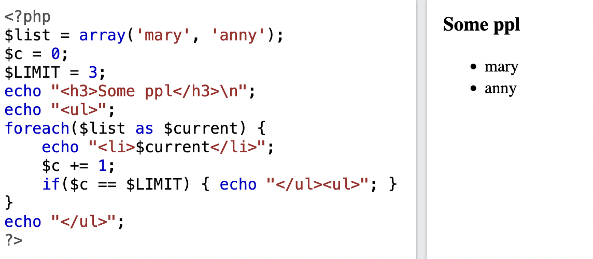

# HCI-vježbe-2022-2023

## Vježba 6: SSG / SSR / CSR

Ova vježba je više fokusirana na NextJS, ali i na tipove renderinga (stvaranja HTML-a) web stranica.

### Povijest: prvo je bio HTML i onda PHP

Jednom davno imali smo samo HTML, CSS i JS. Moderni browseri, slično kao i arhaični, još uvijek razume samo ta tri formata. Progameri su uskoro željeli dinamičan sadržaj; tablice koje se mijenjaju ovisno o podatcima i sl. Onda je došao PHP koji je mogao pisati HTML kod direktno na serveru unutar HTML filea.

Recimo da imamo bazu podataka koja sadrži korisnike i želimo prikazati tablicu korisnika. PHP je jezik koji se može povezati na bazu podataka, povući korisnike i stvoriti HTML, npr. `<ul>` ili `<table>` i ubaciti korisnike. Taj gotovi HTML onda dolazi u browser. Tu je jako bitno sljedeće: **PHP kod se izvršava na serveru. Tek gotovi HTML se šalje u browser**. To je Server Side Rendering. To nije nov koncept.

<p align='center'>
    
</p>

Ako želimo imati više stranica jednostavno napišemo više HTML datoteka i stavimo ih u različite pod foldere. Tako nastaju URL pathovi poput `server-name.com/posts.html` ili `server-name/login.html`.

### Client side rendering i Single page application

Pisanje stvari u PHP-u ima i svoje mane. Rendering logika je vezana uz business logiku, view je spojen na model (jako puno SQLi rupa) i programeri nisu baš voljeli PHP zbog sintakse.

Tu dolaze razni JS libovi i frameworkci među kojima je i React. React ima drugačiji pristup. Kod SSR-a server odradi stvaranje HTML-a što znači da browser dobije cijeli HTML page odmah. Kod React-a browser dobije prazan HTML sa samo jednim `<div id='root'>` elementom u bodyu. React onda traži element koji ima `id=root` i "kači" se na njega (mount). U tom trenutku React preuzima kontrolu nad stranicom i stvara HTML kod unutar tog elementa. To je kod koji smo pisali do sad. Zato sve React funkcije vraćaju HTML.

Više stranica u Reactu je "laž". Zapravo, mi smo uvijek na istoj stranici, samo ovisno o URL-u React prikaže (rendera) drugačiji HTML. To se postiže pomoću _React Routera_ koji koristi `<Switch /> `. Switch radi isto kao i switch u JS-u: za svaki `case` koji je URL path, rendera drugi HTML container tj. drugi page, ali izvorni HTML page se nikad ne mijenja. Sve se to događa u istom HTML fileu kojeg nam je server dao na početku. Ovakve se aplikacije zovu **Single page application** ili **Client side routing**.

Mana ovog pristupa je velika ovisnost o JS-u (primijetite da je svaki file JS), SEO ne postoji ili se radi client-side što ga čini beskorisnim za web botove, teret na strani klijenta, bloated JS i spore aplikacije, nema CDN cache itd.

<p align='center'>

</p>

### Reinventing the wheel: NextJS Server Side Rendering i Generation

NextJS radi kombinaciju oba pristupa i generalno se dijeli u:

-   Client side rendering (isto kao CRA)

i dva tipa server side renderinga:

-   Static Site Generation (SSG)
-   Server Side Rendering (SSR)
-   Incremental Static Regeneration (ISR) (kombinacija prethodna dva)

NextJS dopušta korištenje svih u jednom projektu. Neke stranice mogu biti SSG (npr. about, naslovnica, help), neke SSG (npr. tablice sa sadržajem koji se ne ažurira prečesto) i CSR za stranice gdje SEO nije bitan i koje se ažuriraju uživo.

#### SSG

Ovo je default mode. Stranice se stvaraju jedan put kad se projekt **builda**. Na build možemo gledati kao i na **compile** u C-u ili Javi. To je korak u kojem se source kod pretvara u stranicu. Ako nešto želimo promijeniti nakon, trebamo ponovno pokrenuti complile. Zbog toga je ova metoda najbolja za nepromjenjive stranice (naslovnica, blogovi i sl.). SSG nam daje spreman HTML, CSS i JS koji možemo prebaciti na USB, server ili nešto drugo.

#### SSR

Jedina razlika je što se SSR događa na svaki request dok se SSG događa at build time što može biti jednom i nikad ili par puta mjesečno / godišnje ovisno o potrebi.

<p align='center'>
    
</p>

#### ISR

Kombinacija prethodna dva. Koristimo SSG, ali svako nekoliko dana ili requestova napravimo SSR i spremimo rezultat kao SSG.

#### Više:

[SSR vs SSG](https://tsh.io/blog/ssr-vs-ssg-in-nextjs/)

[Next Docs](https://nextjs.org/docs/basic-features/pages)

## Start

U ovoj vježbi napravit ćemo SSG i SSR stranice s dinamičkim pathovima. Razlika je u ovom slučaju dosta mala.

### Commit 1: List all assets page

Ova stranica će izlistati sve slike u assets folderu. Razmislimo kako to radi. Unutar browsera nije moguće ući u folder koji se nalazi na računalu i prikazati nešto. Ovo je moguće samo na serveru.

Treba nam:

1. Novi page, nazovimo ga `ssr-images.js`
2. Treba reći NextJS-u da želimo SSG (`export getStaticProps`)
3. Trebamo izlistati folder i dati slike u komponentu da se mogu prikazati

Unutar `getStaticProps` možemo izvršiti server-side kod i njegove rezultate poslati u komponentu kao props. Taj kod može biti čitanje diska (kao ovdje), čitanje Markdown/JSON/Text datoteka, pozivanje servera itd.

U ovom primjeru čitamo slike iz foldera i prikazujemo ih:

```jsx
export async function getStaticProps() {
    const images = fs.readdirSync('public/vjezba6');

    return {
        props: {
            images,
        },
    };
}
```

> ✅ Commit  
> `git add .`  
> `git commit -m "Vjezba 6: List all assets page"`

### Commit 2: Dynamic pages

Dosad svaki page nam ima ime i sadržaj. Što ako imamo stranice koje se trebaju stvoriti dinamički? Recimo da imamo webshop. Stranica za pregled artikla izgleda uvijek isto, ali se mijenja naziv artika, slike, opis, cijena i sl. Zapravo, možemo reći da imamo neki template unutar kojeg se mijenja samo sadržaj.

Budući da je NextJS SSR znači li to da trebamo kopirati kod za svaki artikal posebno?  
No.

Za ovaj slučaj možemo koristiti CSR tako da dohvatimo JSON koji nam treba kad se React učita (`onMount`) i dohvatimo podatke koje trebamo i prikažemo stranicu. Isto možemo napraviti na server sa SSR-om. Je li to moguće za SSG? Je!

**DOCS:**  
https://nextjs.org/learn/basics/dynamic-routes/setup

Napravimo jedan dynamic page u `pages/blog`. Damo mu naziv npr. `[someId].js` i sljedeći sadržaj:

```jsx
import { useRouter } from 'next/router';

const SomeBlogPost = () => {
    const router = useRouter();

    return (
        <h1 className="text-2xl">
            HI! You are on{' '}
            <span className="text-red-500">{router.query.someId}</span>
        </h1>
    );
};

export default SomeBlogPost;
```

Ako odemo na `localhost:3000/blog/nesto` dobit ćemo odgovarajući page.

Sve što treba napraviti sad je dohvatiti sadržaj bloga i vratiti ga za svaki page. Ovo je dobar case za SSR!

Trenutno ovo je CSR jer koristimo `useRouter` koji je ReactHook.

Napravimo SSR!

> ✅ Commit  
> `git add .`  
> `git commit -m "Vjezba 6: Dynamic pages"`

### Commit 3: Dynamic pages SSR

Želimo SSR, znači da mičemo router i koristimo posebnu NextJS funkciju za SSR: `getServerSideProps`. Exportamo je iz datoteka gdje name treba i definiramo logiku unutar nje.

Njen parametar je `Context` koji sadrži URL parametre i query. Za sad želimo samo parametar.

Parametar ima `key` koje je jednak imenu datoteke (`someId`) unutar \[zagrada].

Nakon što dobijem taj parametar moramo vratiti objekt koji ima key `props`, a njegov sadržaj je upravo props naše komponente!

```jsx
const SomeBlogPost = ({ someId }) => {
    return (
        <h1 className="text-2xl">
            HI! You are on <span className="text-red-500">{someId}</span>
        </h1>
    );
};

export default SomeBlogPost;

export function getServerSideProps(context) {
    return {
        props: {
            someId: context.params.someId,
        },
    };
}
```

Ako probamo unijeti neki URL param vidjet ćemo da ima isti efekt kao i prije.

> ✅ Commit  
> `git add .`  
> `git commit -m "Vjezba 6: Dynamic pages: SSR"`

### Commit 4: Dynamic pages SSG

Budući da je SSG prebuild, a URL je dinamičan, na prvu se ova kombinacija čini nemogućom. Bila bi da nema jedne pomoćne funkcije koju nam daje NextJS koja se zove `getStaticPaths`. Ta funkcija nam daje mogućnost stvaranja liste stranica koje želimo u SSG-u unaprijed. Svaki URL koji je van te liste je 404. Dakle:

1. Definiramo listu stranica koju ćemo dodat u SSG
2. Sve što nije SSG je not found 404
3. Za svaki definirani path dohvatimo neke podatke (sljedeći commit, za sad opet samo parametar)

Što se tiče implementacije za početak mijenjamo `getServerSideProps` sa `getStaticProps`.

Ako pokušamo pristupiti sad dobit ćemo error. Razlog je jednostavan: Next ne zna koliko stranica treba unaprijed stvoriti.

SSR je radio tako da kad dođe zahtjev Next ga uzima i računa `props`. Međutim, SSG se poziva prije nego je ijedan zahtjev ikad došao na server, tj. prije nego je site objavljen. Koje parametre može očekivati? Realno, apsolutno sve kombinacije slova i brojeva koji postoje. Taj build bi trajao jako dugo :)

Funkcija `getStaticPaths` definira niz dozvoljenih parametara tj. niz stranica za prebuild.

Format koji se vraća je:

```js
{
    paths: [
        {
            params: {
                fileName: 'param-value',
            },
        },
    ];
}
```

Naša bi bila:

```jsx
export function getStaticPaths() {
    return {
        paths: [
            { params: { someId: '1' } },
            { params: { someId: '2' } },
            { params: { someId: '3' } },
            // or strings 😎
            { params: { someId: 'stop' } },
            { params: { someId: 'hammer' } },
            { params: { someId: 'time' } },
        ],
        fallback: false,
    };
}
```

Sve skupa:

```jsx
const SomeBlogPost = ({ someId }) => {
    return (
        <h1 className="text-2xl">
            HI! You are on <span className="text-red-500">{someId}</span>
        </h1>
    );
};

export default SomeBlogPost;

export function getStaticPaths() {
    return {
        paths: [
            { params: { someId: '1' } },
            { params: { someId: '2' } },
            { params: { someId: '3' } },
            { params: { someId: 'stop' } },
            { params: { someId: 'hammer' } },
            { params: { someId: 'time' } },
        ],
        fallback: false,
    };
}

export function getStaticProps(context) {
    return {
        props: {
            someId: context.params.someId,
        },
    };
}
```

> ✅ Commit  
> `git add .`  
> `git commit -m "Vjezba 6: Dynamic pages: SSG"`

### Commit 5: Blog post page SSG

Za kraj prikazat ćemo blog posts template file i za svaki blog post na URL-u dohvatit ćemo podatke.

URL: https://my-json-server.typicode.com/kula124/json-placeholder/

```jsx
const BlogPost = ({ post }) => (
    <main className="w-2/3 mx-auto my-0 flex flex-col items-center">
        <h1 className="text-center text-8xl text-gray-800">{post.title}</h1>
        <h2 className="text-center text-5xl my-8 text-gray-600">
            Some subtitle can go here
        </h2>
        <Image
            className="mx-auto"
            src={post.imgSrc}
            alt="post image"
            layout="fixed"
            width={800}
            height={400}
        />
        <p className="text-gray-800 text-xl mt-16">{post.body}...</p>
        <p>Read more bellow</p>
        <a href={post.link}>
            <span>Learn more</span>
        </a>
    </main>
);

export default BlogPost;
```

Za dohvaćanje pathova koristimo obični get na /posts na dani URL. Kod za to je u `api.js` datoteci:

```js
export async function getStaticPaths() {
    const posts = await api.getPosts();

    const paths = posts.map((post) => ({
        params: {
            someId: post.slug,
        },
    }));

    return {
        paths,
        fallback: false,
    };
}
```

Za svaki pojedini blog post koristimo njegov slug (id):

```jsx
export async function getStaticProps({ params: { someId } }) {
    const post = await api.getPostBySlug(someId);

    return {
        props: {
            post,
        },
    };
}
```

> ✅ Commit  
> `git add .`  
> `git commit -m "Vjezba 6: Blog posts SSG"`

### Commit 6: List all posts

Zadnji sitni commit je jednostavna lista svih blog postova u `index.js` fileu.

Unutar `blog` pagea stvorimo još `index.js` sa sljedećim sadržajem:

Ako idemo na `/blog/` umjesto na `/blog/nesto` onda pogađamo `index.js` unutar tog foldera. To nam može služiti za listanje sadržaja.

```jsx
import api from '../../api';

const Blogs = ({ posts }) => {
    return (
        <div className="flex flex-col items-center">
            <h1 className="text-4xl font-bold">Blog</h1>
            <ul className="flex flex-col items-center">
                {posts.map((post) => (
                    <li key={post.id} className="my-4">
                        <a href={`/blog/${post.slug}`}>{post.title}</a>
                    </li>
                ))}
            </ul>
        </div>
    );
};

export default Blogs;

export async function getStaticProps() {
    // Get list of all posts
    const posts = await api.getPosts();

    return {
        props: { posts },
    };
}
```

> ✅ Commit  
> `git add .`  
> `git commit -m "Vjezba 6: List all posts"`
