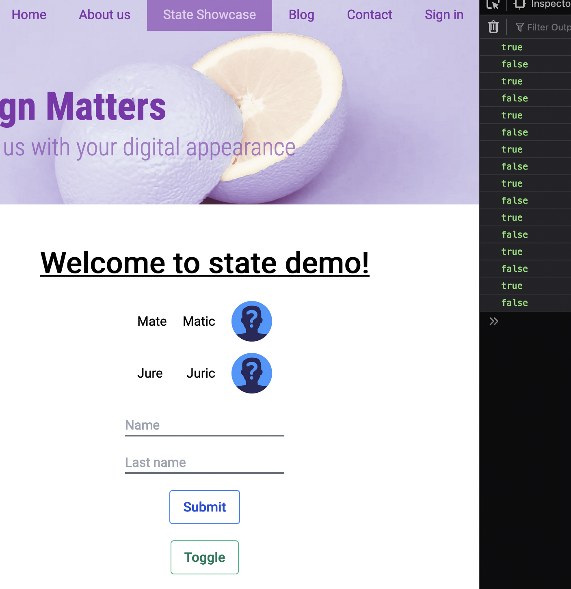

# HCI-vježbe-2022-2023

## Vježba 4: State

U dosadašnjim vježbama upoznali smo bitan aspekt React-a, a to je **props**. Koristili smo ga za prosljeđivanje parametara React funkciji tj. komponenti.

```jsx
<Component thisIsAProp="Hi, I'm prop" objectProp={{ iAm: 'prop' }} />
```

U ovoj vježbi upoznat ćemo drugi bitan aspekt React-a: **state**

State, props i JSX su srž Reacta. U današnjoj vježbi ćemo pisati manje koda nego inače jer ima dosta teorije za proći.

Za demonstraciju koristimo novi page koji je već dodan, ali nije povezan s navigacijom pa će nam prvi korak biti popraviti navigaciju.

### Commit 1: Add new pages to navigation

U `constants/navbar.js` dodajemo dvije novu stranicu: State Showcase na `/state`

Ta stranica se nalazi u `pages/` folderu.

> ✅ Commit  
> `git add .`  
> `git commit -m "Vjezba 4: Add new pages to navigation"`

### Commit 2: Fix navigation linking

U `components/Navbar.js` popravit ćemo navigaciju tako da se možemo navigirati klikom. Koristimo `Link` komponentu koju nam daje _Next_ za ovu svrhu.

> Tehnički možemo koristiti i običan `<a>` tag, ali onda gubimo neke optimizacije koje nam pruža Next. Više o tome u sljedećoj vježbi gdje ćemo se malo više baviti specifičnostima Nexta, a za one koje to zanima tu je Google :)
> To pitanje je dosta popularno.

Dovoljno je samo:

-   Importati `Link` iz `next/link` paketa
-   Zamotati (wrap) `<li>` s `<Link>` komponentom
-   Link prima `href` slično kao i `<a>` tag. Taj href je nama `path`

> ⚠️ `<Link>` zna zezati tj. ne radi ispravno ako imate space između tagova i traži server restart. Ispod je dan gotov primjer, ako zeza kopirajte i ako ne radi probajte ponovno pokrenuti server.

Kod:

```jsx
import { navigationItems } from '../constants/navbar';
import { useRouter } from 'next/router';

import Link from 'next/link';

const NavBar = () => {
    const router = useRouter();
    const currentPage = router.pathname;

    return (
        <nav className="inline-flex list-none font-medium text-hci-lila">
            {navigationItems.map(({ label, path }) => (
                <Link href={path} key={label} passHref>
                    <li
                        key={label}
                        className={`px-5 py-2 whitespace-nowrap hover:bg-hci-lila hover:bg-opacity-50 hover:text-white cursor-pointer ${
                            currentPage === path
                                ? 'text-hci-lila-light bg-hci-lila bg-opacity-60'
                                : ''
                        }`}
                    >
                        {label}
                    </li>
                </Link>
            ))}
        </nav>
    );
};

export default NavBar;
```

> ✅ Commit  
> `git add .`  
> `git commit -m "Vjezba 4: Fix navigation linking"`

### Commit 3: Add toggle to student list [WIP]

> ⚠️ Sljedećih par zadataka riješit ćemo u koracima tako da će kod raditi ispravno tek nakon nekoliko commitova. Ti neispravni commitovi su označeni s [WIP]: **Work in progress**

Idemo na React state. Kliknimo na `State Showcase` u navigaciji i dolazimo na novi page. Njegov file se nalazi u `pages/state.js`.

Za početak, napravimo da se lista studenata može sakriti. Tome će služiti `Toggle` button. Klikom na button možemo sakriti studente. Radimo to u 3 koraka:

    1. Definiramo varijablu koja govori je li lista skrivena ili ne
    2. Definiramo `onClick` funkciju koja mijenja tu varijablu
    3. Ovisno o varijabli vraćamo niz studenata ili prazan tag (možda neku poruku)

```jsx
import React from 'react';
import Image from 'next/image';
import HeaderFooterLayout from '../layouts/HeaderFooterLayout';

const studentsConstArray = [
    {
        id: 1,
        name: 'Mate',
        lName: 'Matic',
        imgSrc: '/profile.jpg',
    },
    {
        id: 2,
        name: 'Jure',
        lName: 'Juric',
        imgSrc: '/profile.jpg',
    },
];

const Student = ({ name, lName, imgSrc }) => {
    return (
        <li className="flex flex-row relative items-center">
            <section className="mr-5 w-24 mt-5 mb-5 flex-row justify-between flex items-center">
                <p>{name}</p>
                <p>{lName}</p>
            </section>
            <Image
                className="absolute right-3 top-3"
                layout="fixed"
                width="50px"
                height="50px"
                src={imgSrc}
                alt="profile image"
            />
        </li>
    );
};

const StateDemo = () => {
    let shouldHideList = false;

    const handleToggle = () => {
        shouldHideList = !shouldHideList;
        console.log(shouldHideList);
    };

    if (shouldHideList) {
        return <p>Sorry, studenti spavaju 😴 </p>;
    }

    return (
        <HeaderFooterLayout>
            <main className="py-8">
                <h1 className="text-center mt-5 mb-5 font-bold text-4xl underline">
                    Welcome to state demo!
                </h1>
                <ul className="flex flex-col items-center justify-around">
                    {studentsConstArray.map((el) => (
                        <Student key={el.id} {...el} />
                    ))}
                </ul>
                <section className="flex flex-col w-64 justify-center items-center my-0 mx-auto border-gray-500">
                    <input
                        className="border-b-2 outline-none mt-5 border-solid border-gray-500"
                        type="text"
                        placeholder="Name"
                    />
                    <input
                        className="border-b-2 outline-none mt-5 border-solid border-gray-500"
                        type="text"
                        placeholder="Last name"
                    />
                    <button className="my-5 cursor-pointer bg-transparent hover:bg-blue-500 text-blue-700 font-semibold hover:text-white py-2 px-4 border border-blue-500 hover:border-transparent rounded">
                        Submit
                    </button>
                </section>
                <button
                    onClick={handleToggle}
                    className="block mx-auto cursor-pointer bg-transparent hover:bg-green-500 text-green-700 font-semibold hover:text-white py-2 px-4 border border-green-500 hover:border-transparent rounded"
                >
                    Toggle
                </button>
            </main>
        </HeaderFooterLayout>
    );
};

export default StateDemo;
```

Ako kliknemo na `Toggle` primijetit ćemo da se ne događa ništa 🤨  
Ali ako otvorimo inspector vidimo da u konzoli imamo sljedeći ispis:

<p align='center'>

</p>

To znači da se naš kod izvršava točno. Što se događa?  
Commitajmo i odgovorit ćemo na to pitanje.

> ✅ Commit  
> `git add .`  
> `git commit -m "Vjezba 4: Add toggle to student list [WIP]"`

### Što je React State?

Što je React State pitanje je koje je odgovoreno mnogo puta. Odgovorit ćemo na to vječno pitanje još jedan put i sad, ali dajemo i linkove na druga objašnjenja (primjere).

Naše detaljno objašnjenje [Ovdje](https://github.com/kula124/HCi_2020_Fresh/tree/project-4--state-and-multipage#react-concept)

Službeni docs: [React Docs](https://reactjs.org/docs/faq-state.html)

Prvo odgovorimo na pitanje zašto kod koji smo napisali ne radi. Primijetimo da je kod koji stvara HTML zapravo funkcija. U trenutku kad se pozvala ̨̨`toggle` vrijedost je `false`. Nakon toga mi mijenjamo tu vrijednost, ali ta funkcija se više ne poziva. Budući da se ne poziva, HTML koji je ona stvorila se ne mijenja. Kada bi se ta funkcija pozvala ponovno HTML bi se promijenio.

Znači treba samo pozvati funkciju ponovno!  
Zapravo, možemo i bolje od toga. Zamislimo samo da svaki put moramo ručno pozivati funkciju kad želimo promijeniti HTML. React nam zato daje jedan poseban dio svog API-a: **React state**. To je posebna varijabla koja kad se promijeni automatski ponovno poziva funkciju. Upravo takva varijabla ili više njih unutar komponente je **React component state**

### Commit 4: Fix toggle state

Naoružani novim znanjem popravimo naš kod. React `useState` API je dan [ovdje](https://reactjs.org/docs/hooks-state.html#declaring-a-state-variable), ali ukratko:

1. Koristimo `useState` funkciju iz React paketa
2. Funkcija vraća niz od dva elementa gdje je prvi element _state varijabla_, a druga je _state setter_ tj. funkcija koja mijenja state.

Umjesto da koristimo `let shouldHideList` koristimo spomenuti state i umjesto da direktno mijenjamo taj state koristimo `setState(newValue)`. To je sve. Probajmo:

```jsx
import { useState } from 'react';
...
const StateDemo = () => {
    const [shouldHideList, setShouldHideList] = useState(false);

    const handleToggle = () => {
        setShouldHideList(!shouldHideList);
        console.log(shouldHideList);
    };

    if (shouldHideList) {
        return <p className="w-min mx-auto min-w-max" >Sorry, studenti spavaju 😴 </p>;
    }
    ...
}
```

Vrijednost `false` unutar `setState()` funkcije je početna vrijednost varijable.

Kod sada radi :)  
Međutim, možemo bolje. Umjesto da vratimo `<p>` probajmo ga vratiti umjesto liste. Koristeći ternarni operator `?` nad novom varijablom možemo vratiti ili listu ili poruku:

```jsx
const StateDemo = () => {
    const [shouldHideList, setShouldHideList] = useState(false);

    const handleToggle = () => {
        setShouldHideList(!shouldHideList);
        console.log(shouldHideList);
    };

    return (
        <HeaderFooterLayout>
            <main className="py-8">
                <h1 className="text-center mt-5 mb-5 font-bold text-4xl underline">
                    Welcome to state demo!
                </h1>
                {shouldHideList ? (
                    <p className="w-min mx-auto min-w-max">
                        Sorry studenti spavaju 😴
                    </p>
                ) : (
                    <ul className="flex flex-col items-center justify-around">
                        {studentsConstArray.map((el) => (
                            <Student key={el.id} {...el} />
                        ))}
                    </ul>
                )}
                <section className="flex flex-col w-64 justify-center items-center my-0 mx-auto border-gray-500">
                    <input
                        className="border-b-2 outline-none mt-5 border-solid border-gray-500"
                        type="text"
                        placeholder="Name"
                    />
                    <input
                        className="border-b-2 outline-none mt-5 border-solid border-gray-500"
                        type="text"
                        placeholder="Last name"
                    />
                    <button className="my-5 cursor-pointer bg-transparent hover:bg-blue-500 text-blue-700 font-semibold hover:text-white py-2 px-4 border border-blue-500 hover:border-transparent rounded">
                        Submit
                    </button>
                </section>
                <button
                    onClick={handleToggle}
                    className="block mx-auto cursor-pointer bg-transparent hover:bg-green-500 text-green-700 font-semibold hover:text-white py-2 px-4 border border-green-500 hover:border-transparent rounded"
                >
                    Toggle
                </button>
            </main>
        </HeaderFooterLayout>
    );
};
```

Fancy naziv za ovo je **Conditional Rendering**.

> ✅ Commit  
> `git add .`  
> `git commit -m "Vjezba 4: Fix toggle state"`

### Commit 5: Add new student [WIP]

Zadatak nam je dodati novog studenta. Kao korisnici upišemo ime i prezime novog studenta i klikom na submit pojavi se u listi. Vidimo da lista radi map nad `studentsConstArray`. To je fiksan niz studenata definiran van komponente. Možemo gledati na to kao na niz kojeg nam vraća neki server.

Za početak zanemarimo input i probajmo samo dodati nekog random sudenta u listu koristeći state čisto da vidimo da radi.

Radimo isto što i za toggle.

```jsx
const StateDemo = () => {
    const [shouldHideList, setShouldHideList] = useState(false);
    const [students, setStudents] = useState(studentsConstArray);

    const handleToggle = () => {
        setShouldHideList(!shouldHideList);
        console.log(shouldHideList);
    };

    const handleSubmit = () => {
        const newStudent = {
            id: students.length + 1,
            name: 'Ivo',
            lastName: 'Ivic',
            imgSrc: '/profile.jpg',
        };

        students.push(newStudent);
        setStudents(students);
        console.log(students);
    };

    return (
        <HeaderFooterLayout>
            <main className="py-8">
                <h1 className="text-center mt-5 mb-5 font-bold text-4xl underline">
                    Welcome to state demo!
                </h1>
                {shouldHideList ? (
                    <p className="w-min mx-auto min-w-max">
                        Sorry studenti spavaju 😴
                    </p>
                ) : (
                    <ul className="flex flex-col items-center justify-around">
                        {students.map((el) => (
                            <Student key={el.id} {...el} />
                        ))}
                    </ul>
                )}
                <section className="flex flex-col w-64 justify-center items-center my-0 mx-auto border-gray-500">
                    <input
                        className="border-b-2 outline-none mt-5 border-solid border-gray-500"
                        type="text"
                        placeholder="Name"
                    />
                    <input
                        className="border-b-2 outline-none mt-5 border-solid border-gray-500"
                        type="text"
                        placeholder="Last name"
                    />
                    <button
                        onClick={handleSubmit}
                        className="my-5 cursor-pointer bg-transparent hover:bg-blue-500 text-blue-700 font-semibold hover:text-white py-2 px-4 border border-blue-500 hover:border-transparent rounded"
                    >
                        Submit
                    </button>
                </section>
                <button
                    onClick={handleToggle}
                    className="block mx-auto cursor-pointer bg-transparent hover:bg-green-500 text-green-700 font-semibold hover:text-white py-2 px-4 border border-green-500 hover:border-transparent rounded"
                >
                    Toggle
                </button>
            </main>
        </HeaderFooterLayout>
    );
};
```

> ⚠️ Pripazita da ste zamjenili `studentsConstArray.map()` sa `students.map()`

Ako kliknemo na `submit` vidimo da se ne događa ništa 🤔  
Ali ako kliknemo na `Toggle` pojavili su se novi studenti??  
Zašto?

Commit pa ću vam reći!

> ✅ Commit  
> `git add .`  
> `git commit -m "Vjezba 4: Add new student [WIP]"`

### SetState state comparison

JavaScript je dynamic language što znači da su tipovi dinamički dodijeljeni. Jedini način da to radi kako treba je da su sve varijable (osim nekih) reference tj. pointeri na vrijednost. To znači da svaki put kad napišemo

```js
const arr = [];
```

mi stvaramo novi niz čiji je pointer `arr` tj. `arr` ne sadrži vrijednost niza nego pointer na niz. Prisjetimo se kako radi C :)

```js
const arr1 = [];
const arr2 = arr1;
const arr3 = [];

console.log(arr1 === arr2);
// true
arr1.push(3);
console.log(arr1 === arr2);
// true

console.log(arr1 === arr3 || arr2 === arr3);
// false
console.log([] === []);
// false
console.log({} === {});
// false
```

Zašto su zadnja dva `false`? Jer JS stvara nove objekte i onda uspoređuje njihovu adresu (pointer), ne sadržaj.

!!\***\*Ovo je jako bitno kod React-a\*\***!!

`setState` ima jednu bitnu optimizaciju: ako je novi state jednak starom neće se izvršiti. Pogledajmo što smo napisali:

```jsx
const handleSubmit = () => {
    const newStudent = {
        id: students.length + 1,
        name: 'Ivo',
        lastName: 'Ivic',
        imgSrc: '/profile.jpg',
    };

    students.push(newStudent);
    // Iako se dodaje novi student, adresa niza je ista
    setStudents(students);
    // Što znači da React preskače setState
    console.log(students);
};
```

Na pitanje zašto se pojave studenti ako napravimo toggle sad bismo već trebali znati odgovor.

<details>
<summary>Tko ne zna i zna da ne zna... ili samo želi biti siguran :) </summary>

Broj studenata se povećao, ali budući da se nije izvršio `setState` nije se ni ponovno pozvala funkcija tako da smo opet na istom problemu kao i na početku. Podatci su točni samo treba pozvati funkciju. Kad kliknemo na Toggle to se dogodi i pojave se novi studenti.

</details>
<br>

### Commit 6: Add new students correctly

Ne pozivamo push! Nikad ne smijemo mutirati React state van poziva `setState` funkcije. Umjesto toga stvaramo novi niz, kopiramo stari niz unutar njega i dodamo novog studenta. Svo ovo je jedna linija koda:

```jsx
const handleSubmit = () => {
    const newStudent = {
        id: students.length + 1,
        name: 'Ivo',
        lastName: 'Ivic',
        imgSrc: '/profile.jpg',
    };

    setStudents([...students, newStudent]);
};
```

<details>
<summary>Cijeli kod</summary>

```jsx
import { useState } from 'react';
import Image from 'next/image';
import HeaderFooterLayout from '../layouts/HeaderFooterLayout';

const studentsConstArray = [
    {
        id: 1,
        name: 'Mate',
        lastName: 'Matic',
        imgSrc: '/profile.jpg',
    },
    {
        id: 2,
        name: 'Jure',
        lastName: 'Juric',
        imgSrc: '/profile.jpg',
    },
];

const Student = ({ name, lastName, imgSrc }) => {
    return (
        <li className="flex flex-row relative items-center">
            <section className="mr-5 w-24 mt-5 mb-5 flex-row justify-between flex items-center">
                <p>{name}</p>
                <p>{lastName}</p>
            </section>
            <Image
                className="absolute right-3 top-3"
                layout="fixed"
                width="50px"
                height="50px"
                src={imgSrc}
                alt="profile image"
            />
        </li>
    );
};

const StateDemo = () => {
    const [shouldHideList, setShouldHideList] = useState(false);
    const [students, setStudents] = useState(studentsConstArray);

    const handleToggle = () => {
        setShouldHideList(!shouldHideList);
        console.log(shouldHideList);
    };

    const handleSubmit = () => {
        const newStudent = {
            id: students.length + 1,
            name: 'Ivo',
            lastName: 'Ivic',
            imgSrc: '/profile.jpg',
        };

        setStudents([...students, newStudent]);
        console.log(students);
    };

    return (
        <HeaderFooterLayout>
            <main className="py-8">
                <h1 className="text-center mt-5 mb-5 font-bold text-4xl underline">
                    Welcome to state demo!
                </h1>
                {shouldHideList ? (
                    <p className="w-min mx-auto min-w-max">
                        Sorry studenti spavaju 😴
                    </p>
                ) : (
                    <ul className="flex flex-col items-center justify-around">
                        {students.map((el) => (
                            <Student key={el.id} {...el} />
                        ))}
                    </ul>
                )}
                <section className="flex flex-col w-64 justify-center items-center my-0 mx-auto border-gray-500">
                    <input
                        className="border-b-2 outline-none mt-5 border-solid border-gray-500"
                        type="text"
                        placeholder="Name"
                    />
                    <input
                        className="border-b-2 outline-none mt-5 border-solid border-gray-500"
                        type="text"
                        placeholder="Last name"
                    />
                    <button
                        onClick={handleSubmit}
                        className="my-5 cursor-pointer bg-transparent hover:bg-blue-500 text-blue-700 font-semibold hover:text-white py-2 px-4 border border-blue-500 hover:border-transparent rounded"
                    >
                        Submit
                    </button>
                </section>
                <button
                    onClick={handleToggle}
                    className="block mx-auto cursor-pointer bg-transparent hover:bg-green-500 text-green-700 font-semibold hover:text-white py-2 px-4 border border-green-500 hover:border-transparent rounded"
                >
                    Toggle
                </button>
            </main>
        </HeaderFooterLayout>
    );
};

export default StateDemo;
```

</details>

> ✅ Commit  
> `git add .`  
> `git commit -m "Vjezba 4: Add new student correctly"`

### Commit 7: Input state

Pozabavimo se inputima. Za svaki input stvaramo poseban state. Input ima dva propa koja koristimo:

1. `value`: trenutna vrijednost
2. `onChange`: callback funkcija oblika `(event) => {}` koja se poziva kad se promijeni `value`. Novi value se nalazi u `event.target.value`.

Kako to znam?  
Ovo nije vezano za React. Ova dva propa su dio HTML `<input>` definicije. Ono što je novo je spajanje `value` propa na React state. Bacite oko na W3.

```jsx
const StateDemo = () => {
    const [shouldHideList, setShouldHideList] = useState(false);
    const [students, setStudents] = useState(studentsConstArray);

    const [nameInputValue, setNameInputValue] = useState('');
    const [lastNameInputValue, setLastNameInputValue] = useState('');

    const handleToggle = () => {
        setShouldHideList(!shouldHideList);
        console.log(shouldHideList);
    };

    const handleSubmit = () => {
        const newStudent = {
            id: students.length + 1,
            name: nameInputValue,
            lastName: lastNameInputValue,
            imgSrc: '/profile.jpg',
        };

        setStudents([...students, newStudent]);
        console.log(students);
    };

    return (
        <HeaderFooterLayout>
            <main className="py-8">
                <h1 className="text-center mt-5 mb-5 font-bold text-4xl underline">
                    Welcome to state demo!
                </h1>
                {shouldHideList ? (
                    <p className="w-min mx-auto min-w-max">
                        Sorry studenti spavaju 😴
                    </p>
                ) : (
                    <ul className="flex flex-col items-center justify-around">
                        {students.map((el) => (
                            <Student key={el.id} {...el} />
                        ))}
                    </ul>
                )}
                <section className="flex flex-col w-64 justify-center items-center my-0 mx-auto border-gray-500">
                    <input
                        value={nameInputValue}
                        onChange={(e) => setNameInputValue(e.target.value)}
                        className="border-b-2 outline-none mt-5 border-solid border-gray-500"
                        type="text"
                        placeholder="Name"
                    />
                    <input
                        value={lastNameInputValue}
                        onChange={(e) => setLastNameInputValue(e.target.value)}
                        className="border-b-2 outline-none mt-5 border-solid border-gray-500"
                        type="text"
                        placeholder="Last name"
                    />
                    <button
                        onClick={handleSubmit}
                        className="my-5 cursor-pointer bg-transparent hover:bg-blue-500 text-blue-700 font-semibold hover:text-white py-2 px-4 border border-blue-500 hover:border-transparent rounded"
                    >
                        Submit
                    </button>
                </section>
                <button
                    onClick={handleToggle}
                    className="block mx-auto cursor-pointer bg-transparent hover:bg-green-500 text-green-700 font-semibold hover:text-white py-2 px-4 border border-green-500 hover:border-transparent rounded"
                >
                    Toggle
                </button>
            </main>
        </HeaderFooterLayout>
    );
};
```

> ℹ️ Input ovdje je `controlled`! To znači da je njegov parent odgovoran za njegov `value` tj. `value` mu se prosljeđuje kao prop. Ponekad input može biti i `uncontrolled` tj. parent prosljeđuje samo `onChangeHandler` ili ništa. Ovi izrazi se često koriste kod UI Frameworka pa se nije loše upoznati s njima :)

> ✅ Commit  
> `git add .`  
> `git commit -m "Vjezba 4: Input state"`

### Commit 8: Input object state

Pokazali smo state kao `boolean`, `string` i `array`. Budući da su `string` i `number` slični ostaje nam samo još object state. Pa pokažimo i to. Umjesto četiri state varijable koristimo jednu koja je object i sadrži 4 propertia (polja):

```jsx
const StateDemo = () => {
    const [state, setState] = useState({
        shouldHideList: false,
        students: studentsConstArray,
        nameInputValue: '',
        lastNameInputValue: '',
    });

    const handleToggle = () => {
        setState({
            ...state, // kopiraj sve iz state objekta
            shouldHideList: !state.shouldHideList, // i promijeni samo ono sto je potrebno
        });
    };

    const handleSubmit = () => {
        const newStudent = {
            id: state.students.length + 1,
            name: state.nameInputValue,
            lastName: state.lastNameInputValue,
            imgSrc: '/profile.jpg',
        };

        setState({
            ...state,
            students: [...state.students, newStudent],
            nameInputValue: '',
            lastNameInputValue: '',
        });
    };

    return (
        <HeaderFooterLayout>
            <main className="py-8">
                <h1 className="text-center mt-5 mb-5 font-bold text-4xl underline">
                    Welcome to state demo!
                </h1>
                {state.shouldHideList ? (
                    <p className="w-min mx-auto min-w-max">
                        Sorry studenti spavaju 😴
                    </p>
                ) : (
                    <ul className="flex flex-col items-center justify-around">
                        {state.students.map((el) => (
                            <Student key={el.id} {...el} />
                        ))}
                    </ul>
                )}
                <section className="flex flex-col w-64 justify-center items-center my-0 mx-auto border-gray-500">
                    <input
                        value={state.nameInputValue}
                        onChange={(e) =>
                            setState({ ...state, nameInputValue: e.target.value })
                        }
                        className="border-b-2 outline-none mt-5 border-solid border-gray-500"
                        type="text"
                        placeholder="Name"
                    />
                    <input
                        value={state.lastNameInputValue}
                        onChange={(e) =>
                            setState({
                                ...state,
                                lastNameInputValue: e.target.value,
                            })
                        }
                        className="border-b-2 outline-none mt-5 border-solid border-gray-500"
                        type="text"
                        placeholder="Last name"
                    />
                    <button
                        onClick={handleSubmit}
                        className="my-5 cursor-pointer bg-transparent hover:bg-blue-500 text-blue-700 font-semibold hover:text-white py-2 px-4 border border-blue-500 hover:border-transparent rounded"
                    >
                        Submit
                    </button>
                </section>
                <button
                    onClick={handleToggle}
                    className="block mx-auto cursor-pointer bg-transparent hover:bg-green-500 text-green-700 font-semibold hover:text-white py-2 px-4 border border-green-500 hover:border-transparent rounded"
                >
                    Toggle
                </button>
            </main>
        </HeaderFooterLayout>
    );
};

export default StateDemo;
```

> ✅ Commit  
> `git add .`  
> `git commit -m "Vjezba 4: Input object state"`

### Commit 8: Add filtering

Filtriranje se dosta često koristi u React-u i dio je našeg seminarskog zadatka. Ovdje imamo listu sa studentima i input. Znači sve što nam je potrebno za napraviti filter :)

Filter se sastoji od 4 dijela:

1. Data source
2. Filter funkcija
3. Filtered data
4. Clear filter

Data source su početni podatci. To je u ovom slučaju lista studenata. Kad se filter ugasi onda se vraćamo na početne podatke. To su ujedno i podatci koje filtriramo.

Filter funkcija je funkcija koja radi filtriranje. Najčešće ili prima niz ili se poziva nad nizom. Kod JS-a se poziva nad nizom isto kao i `.map()`. U JS-u vraća novi filtrirani niz, a prima _predikat_ (funkciju koja vraća _boolean_). Filtriranje se vrši na temelju filter inputa.

Nakon filtiranja spremamo novi niz u state. Taj novi state se koristi za rendering umjesto originalnih podataka.

Kada želimo ugasiti filter onda trebamo:

1. Staviti `Filtered Data` da bude jednak `Data sourceu`
2. Isprazniti filter input

U našoj implementaciji taj button se prikaže samo ako filter input nije prazan. Ako jest, onda ga baš i nema smisla prikazivati.

Dakle:

1. Dodajemo još jedan input za filter. Dodajemo i container za button
2. Dodajemo novi state za filter input i filtered data
3. Dodajemo Handler za filter input
4. Dodajemo Handle za clear button
5. Ako je lista prazna prikažemo poruku

Voilà!

```jsx
const StateDemo = () => {
    const [state, setState] = useState({
        shouldHideList: false,
        students: studentsConstArray,
        nameInputValue: '',
        lastNameInputValue: '',
    });

    const [filteredStudents, setFilteredStudents] = useState(state.students);
    const [filterValue, setFilterValue] = useState('');
    const [showShowClearButton, setShowClearButton] = useState(false);

    const handleFilterChange = (e) => {
        const { value } = e.target;
        setFilterValue(value);
        if (value.length > 0) {
            setShowClearButton(true);
        } else {
            setShowClearButton(false);
        }

        const filteredStudents = state.students.filter((student) => {
            return (
                student.name.toLowerCase().includes(value.toLowerCase()) ||
                student.lastName.toLowerCase().includes(value.toLowerCase())
            );
        });

        setFilteredStudents(filteredStudents);
    };

    const handleClearFilter = () => {
        setFilterValue('');
        setShowClearButton(false);
        setFilteredStudents(state.students);
    };

    const handleToggle = () => {
        setState({
            ...state, // kopiraj sve iz state objekta
            shouldHideList: !state.shouldHideList, // i promijeni samo ono sto je potrebno
        });
    };

    const handleSubmit = () => {
        const newStudent = {
            id: state.students.length + 1,
            name: state.nameInputValue,
            lastName: state.lastNameInputValue,
            imgSrc: '/profile.jpg',
        };

        setState({
            ...state,
            students: [...state.students, newStudent],
            nameInputValue: '',
            lastNameInputValue: '',
        });

        setFilteredStudents([...filteredStudents, newStudent]);
    };

    return (
        <HeaderFooterLayout>
            <main className="py-8">
                <h1 className="text-center mt-5 mb-5 font-bold text-4xl underline">
                    Welcome to state demo!
                </h1>
                {state.shouldHideList || filteredStudents.length <= 0 ? (
                    <p className="w-min mx-auto min-w-max">
                        Sorry studenti spavaju 😴
                    </p>
                ) : (
                    <ul className="flex flex-col items-center justify-around">
                        {filteredStudents.map((el) => (
                            <Student key={el.id} {...el} />
                        ))}
                    </ul>
                )}
                <section className="flex flex-col w-64 justify-center items-center my-0 mx-auto border-gray-500">
                    <input
                        value={state.nameInputValue}
                        onChange={(e) =>
                            setState({ ...state, nameInputValue: e.target.value })
                        }
                        className="border-b-2 outline-none mt-5 border-solid border-gray-500"
                        type="text"
                        placeholder="Name"
                    />
                    <input
                        value={state.lastNameInputValue}
                        onChange={(e) =>
                            setState({
                                ...state,
                                lastNameInputValue: e.target.value,
                            })
                        }
                        className="border-b-2 outline-none mt-5 border-solid border-gray-500"
                        type="text"
                        placeholder="Last name"
                    />
                    <button
                        onClick={handleSubmit}
                        className="my-5 cursor-pointer bg-transparent hover:bg-blue-500 text-blue-700 font-semibold hover:text-white py-2 px-4 border border-blue-500 hover:border-transparent rounded"
                    >
                        Submit
                    </button>
                </section>
                <button
                    onClick={handleToggle}
                    className="block mx-auto cursor-pointer bg-transparent hover:bg-green-500 text-green-700 font-semibold hover:text-white py-2 px-4 border border-green-500 hover:border-transparent rounded"
                >
                    Toggle
                </button>
                <section className="min-w-80 flex w-full justify-center items-center mt-12">
                    <input
                        value={filterValue}
                        onChange={handleFilterChange}
                        className="border-b-2 outline-none border-solid border-gray-500"
                        type="text"
                        placeholder="Filter input"
                    />
                    {showShowClearButton && (
                        <button
                            onClick={handleClearFilter}
                            className="ml-4 rounded-md border-2 border-red-400
                            text-red-500 py-0.5 px-4"
                        >
                            Clear
                        </button>
                    )}
                </section>
            </main>
        </HeaderFooterLayout>
    );
};
```

> ✅ Commit  
> `git add .`  
> `git commit -m "Vjezba 4: Add filtering"`
